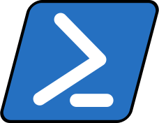

 See instructions in the comments below for how to edit specific sections of this workshop template. 


  HEADER

  Edit the values in the block above to be appropriate for your workshop.
  If the value is not 'true', 'false', 'null', or a number, please use
  double quotation marks around the value, unless specified otherwise.
  And run 'make workshop-check' *before* committing to make sure that changes are good.



  EVENTBRITE

  This block includes the Eventbrite registration widget if
  'eventbrite' has been set in the header.  You can delete it if you
  are not using Eventbrite, or leave it in, since it will not be
  displayed if the 'eventbrite' field in the header is not set.


<iframe
  src="https://www.eventbrite.com/tickets-external?eid={{page.eventbrite}}&ref=etckt"
  frameborder="0"
  width="100%"
  height="248px"
  scrolling="auto">
</iframe>


<h2 id="general">General Information</h2>


  INTRODUCTION

  Edit the general explanatory paragraph below if you want to change
  the pitch.


  

  

  



  AUDIENCE

  Explain who your audience is.  (In particular, tell readers if the
  workshop is only open to people from a particular institution.


  

  

  



  LOCATION

  This block displays the address and links to maps showing directions
  if the latitude and longitude of the workshop have been set.  You
  can use https://itouchmap.com/latlong.html to find the lat/long of an
  address.



  <strong>Where:</strong>
  {{page.address}}.
  Get directions with
  <a href="//www.openstreetmap.org/?mlat={{page.latlng | replace:',','&mlon='}}&zoom=16">OpenStreetMap</a>
  or
  <a href="//maps.google.com/maps?q={{page.latlng}}">Google Maps</a>.




  DATE

  This block displays the date and links to Google Calendar.



  <strong>When:</strong>
  {{page.humandate}}.
  




  SPECIAL REQUIREMENTS

  Modify the block below if there are any special requirements.


  <strong>Requirements:</strong> Participants must bring a laptop with a
  Mac, Linux, or Windows operating system (not a tablet, Chromebook, etc.) that they have administrative privileges
  on. They should have a few specific software packages installed (listed
  <a href="#setup">below</a>). They are also required to abide by
  
  Software Carpentry's
  
  Data Carpentry's
  
  Library Carpentry's
  
  <a href="{{site.swc_site}}/conduct.html">Code of Conduct</a>.


  ACCESSIBILITY

  Modify the block below if there are any barriers to accessibility or
  special instructions.


  <strong>Accessibility:</strong> We are committed to making this workshop
  accessible to everybody.
  The workshop organizers have checked that:

<ul>
  <li>The room is wheelchair / scooter accessible.</li>
  <li>Accessible restrooms are available.</li>
</ul>


  CONTACT EMAIL ADDRESS

  Display the contact email address set in the configuration file.


  <strong>Contact</strong>:
  Please email
  
    
      
	or
      
	
	,
	
      
      <a href='mailto:{{email}}'>{{email}}</a>
    
  
    to-be-announced
  
  for more information.


 SURVEYS - DO NOT EDIT SURVEY LINKS

<h2 id="surveys">Surveys</h2>



Please be sure to complete these surveys before and after the workshop.

<a href="{{ site.swc_pre_survey }}{{ site.github.project_title }}">Pre-workshop Survey</a>

<a href="{{ site.swc_post_survey }}{{ site.github.project_title }}">Post-workshop Survey</a>


  
Please be sure to complete these surveys before and after the workshop.

<a href="{{ site.dc_pre_survey }}{{ site.github.project_title }}">Pre-workshop Survey</a>

<a href="{{ site.dc_post_survey }}{{ site.github.project_title }}">Post-workshop Survey</a>



Ask your instructor about pre- and post-workshop Survey details.




  SCHEDULE

  Show the workshop's schedule.  Edit the items and times in the table
  to match your plans.  You may also want to change 'Day 1' and 'Day
  2' to be actual dates or days of the week.

<h2 id="schedule">Schedule</h2>


  

  

  



  Collaborative Notes

  If you want to use an Etherpad, go to

      http://pad.software-carpentry.org/YYYY-MM-DD-site

  where 'YYYY-MM-DD-site' is the identifier for your workshop,
  e.g., '2015-06-10-esu'.



  We will use this <a href="{{page.collaborative_notes}}">collaborative document</a> for chatting, taking notes, and sharing URLs and bits of code.




  SYLLABUS

  Show what topics will be covered.

  1. If your workshop is R rather than Python, remove the comment
     around that section and put a comment around the Python section.
  2. Some workshops will delete SQL.
  3. Please make sure the list of topics is synchronized with what you
     intend to teach.
  4. You may need to move the div's with class="col-md-6" around inside
     the div's with class="row" to balance the multi-column layout.

  This is one of the places where people frequently make mistakes, so
  please preview your site before committing, and make sure to run
  'tools/check' as well.

<h2 id="syllabus">Syllabus</h2>


  

  

  



  SETUP

  Delete irrelevant sections from the setup instructions.  Each
  section is inside a 'div' without any classes to make the beginning
  and end easier to find.

  This is the other place where people frequently make mistakes, so
  please preview your site before committing, and make sure to run
  'tools/check' as well.


<h2 id="setup">Setup</h2>

  To participate in a
  
  Software Carpentry
  
  Data Carpentry
  
  Library Carpentry
  
  workshop,
  you will need access to the software described below.
  In addition, you will need an up-to-date web browser.

  We maintain a list of common issues that occur during installation as a reference for instructors
  that may be useful on the
  <a href = "{{site.swc_github}}/workshop-template/wiki/Configuration-Problems-and-Solutions">Configuration Problems and Solutions wiki page</a>.

  Start of 'shell' section. 
  <h3>The Bash Shell</h3>

  

    Bash is a commonly-used shell that gives you the power to do simple
    tasks more quickly.
  

  

    

      <h4 id="shell-windows">Windows</h4>
      <ol>
	<li>Install Ubuntu for Windows
	  <ol>
	    <li>Open the Microsoft Store</li>
	    <li>Search for 'Ubuntu'</li>
	    <li>Select Ubuntu 18.04 and hit install</li>
	  </ol>
	</li>
	<li>Enable the Windows Subsystem for Linux
	  <ol>
	    <li>Open the Windows Power shell as an administrator
	      <ol>
		<li>Click the  Windows icon in the lower left corner of your screen to open the start menu</li>
		<li>In the start menu, search for "Powershell"</li>
		<li>Right click on the  Microsoft Powershell icon and select "Run as administrator"</li>
		<li>When prompted, click <tt>Yes</tt> to allow powershell to modify your device</li>
	      </ol>
	    </li>
	    <li> In the Powershell enter the following command:
	      <pre style="white-space: pre; border-radius: 15px; background-color: #0000FF; color: white"><code style="white-space: pre">
Enable-WindowsOptionalFeature -Online -FeatureName Microsoft-Windows-Subsystem-Linux
	      </code></pre>
	    </li>
	    <li>Close power shell</li>
	  </ol>
	</li>
	<li>Restart your computer
	  <ol>
	    <li>Click the  Windows icon in the lower left corner of your screen to open the start menu</li>
	    <li>Click the  Power icon in the start menu</li>
	    <li>Select <tt>Restart</tt></li>
	  </ol>
	</li>
	<li> Open the "Ubuntu" application
	  <ol>
	    <li>Click the  Windows icon in the lower left corner of your screen to open the start menu</li>
	    <li>In the start menu, search for "Ubuntu"</li>
	    <li>Click the  Ubuntu icon in the search results</li>
	    <li>A black bash window will appear with the message
	      <pre style="white-space: pre; border-radius: 15px; background-color: black; color: white"><code style="white-space: pre">
Installing, this may take a few moments...
	      </code></pre>
	    </li>
	    <li>When the installation is complete, you will be prompted to create a username.
	      <pre style="white-space: pre; border-radius: 15px; background-color: black; color: white"><code style="white-space: pre">
Installing, this may take a few minutes...
Installation successful!
Please create a default UNIX user account. The username does not need to match your Windows username.
For more information visit: https://aka.ms/wslusers
Enter new UNIX username:
	      </code></pre>
	    </li>
	    <li>Type a desired username and press enter</li>
	    <li>You will be prompted to provide a password for the new account.
	      <pre style="white-space: pre; border-radius: 15px; background-color: black; color: white"><code style="white-space: pre">
Enter new UNIX password:
	      </code></pre>
	    </li>
	    <li>Type a memorable and secure password and press enter. This password is case-sensitive and cannot be recovered if forgotten. Do not be alarmed if no text appears on the screen as you enter the password. </li>
	    <li>You will be prompted to confirm the password.
	      <pre style="white-space: pre; border-radius: 15px; background-color: black; color: white"><code style="white-space: pre">
Enter new UNIX password:
Retype new UNIX password:
	      </code></pre>
	    </li>
	    <li>Retype the password and press enter</li>
	    <li>Assuming the passwords match, a message confirming the password update should appear
	      <pre style="white-space: pre; white-space: pre; border-radius: 15px; background-color: black; color: white"><code style="white-space: pre">
Enter new UNIX password:
Retype new UNIX password:
passwd: password updated successfully
	      </code></pre>
	    </li>
	    <li>A UNIX shell is successfully installed on your system</li>
	  </ol>
	</li>
      </ol>
    

    

      <h4 id="shell-macosx">macOS</h4>
      

	The default shell in all versions of macOS is Bash, so no
	need to install anything.  You access Bash from the Terminal
	(found in
	<code>/Applications/Utilities</code>).
	See the Git installation <a href="https://www.youtube.com/watch?v=9LQhwETCdwY ">video tutorial</a>
	for an example on how to open the Terminal.
	You may want to keep
	Terminal in your dock for this workshop.
      

    

    

      <h4 id="shell-linux">Linux</h4>
      

	The default shell is usually Bash, but if your
	machine is set up differently you can run it by opening a
	terminal and typing <code>bash</code>.  There is no need to
	install anything.
      

    

  

  End of 'shell' section. 

  Start of 'Git' section. GitHub browser compatability
	   is given at https://help.github.com/articles/supported-browsers/
  <h3>Git</h3>
  

    Git is a version control system that lets you track who made changes
    to what when and has options for easily updating a shared or public
    version of your code
    on <a href="https://github.com/">github.com</a>. You will need a
    <a href="https://help.github.com/articles/supported-browsers/">supported</a>
    web browser (current versions of Chrome, Firefox or Safari,
    or Internet Explorer version 9 or above).
  

  

    You will need an account at <a href="https://github.com/">github.com</a>
    for parts of the Git lesson. Basic GitHub accounts are free. We encourage
    you to create a GitHub account if you don't have one already.
    Please consider what personal information you'd like to reveal. For
    example, you may want to review these
    <a href="https://help.github.com/articles/keeping-your-email-address-private/">instructions
    for keeping your email address private</a> provided at GitHub.
  

  

    

      <h4 id="git-windows">Windows</h4>
      

	Git can be installed on your computer following Bash install (described above).
      

      <ol>
	<li> Open a Bash terminal window
	  <ol>
	    <li>Click the  Windows icon in the lower left corner of your screen to open the start menu</li>
	    <li>In the start menu, search for "Ubuntu"</li>
	    <li>Click the  Ubuntu icon in the search results</li>
	    <li>Click within the black Bash terminal screen that appears</li>
	  </ol>
	</li>
	<li> Use the <tt>apt</tt> package manager distributed with Ubuntu to install <tt>git</tt>
	  <ol>
	    <li>Type <tt>sudo apt-get update</tt> and press enter</li>
	    <li>When prompted for a password, enter the password established when installing Bash</li>
	    <li>Type <tt>sudo apt-get install git</tt> and press enter</li>
	    <li>If prompted for a password, again enter the password established when installing Bash</li>
	  </ol>
	</li>
      </ol>
    

    

      <h4 id="git-macosx">macOS</h4>
      <a href="https://www.youtube.com/watch?v=9LQhwETCdwY ">Video Tutorial</a>
      

	<strong>For OS X 10.9 and higher</strong>, install Git for Mac
	by downloading and running the most recent "mavericks" installer from
	<a href="http://sourceforge.net/projects/git-osx-installer/files/">this list</a>.
	After installing Git, there will not be anything in your <code>/Applications</code> folder,
	as Git is a command line program.
	<strong>For older versions of OS X (10.5-10.8)</strong> use the
	most recent available installer labeled "snow-leopard"
	<a href="http://sourceforge.net/projects/git-osx-installer/files/">available here</a>.
      

    

    

      <h4 id="git-linux">Linux</h4>
      

	If Git is not already available on your machine you can try to
	install it via your distro's package manager. For Debian/Ubuntu run
	<code>sudo apt-get install git</code> and for Fedora run
	<code>sudo dnf install git</code>.
      

    

  

  End of 'Git' section. 

  Start of 'editor' section. 
  <h3>Text Editor</h3>

  

    When you're writing code, it's nice to have a text editor that is
    optimized for writing code, with features like automatic
    color-coding of key words.  The default text editor on macOS and
    Linux is usually set to Vim, which is not famous for being
    intuitive.  If you accidentally find yourself stuck in it, try
    typing the escape key, followed by <code>:q!</code> (colon, lower-case 'q',
    exclamation mark), then hitting Return to return to the shell.
  

  

    

      <h4 id="editor-windows">Windows</h4>
      
nano is a basic editor that can be used for all the modules in this workshop, it is included in the Ubuntu distribution

    

    

      <h4 id="editor-macosx">macOS</h4>
      

	nano is a basic editor and the default that instructors use in the workshop.
	See the Git installation <a href="https://www.youtube.com/watch?v=9LQhwETCdwY ">video tutorial</a>
	for an example on how to open nano.
	It should be pre-installed.
      

      

	Others editors that you can use are
	<a href="https://www.barebones.com/products/textwrangler/">Text Wrangler</a> or
	<a href="https://www.sublimetext.com/">Sublime Text</a>.
      

    

    

      <h4 id="editor-linux">Linux</h4>
      

	nano is a basic editor and the default that instructors use in the workshop.
	It should be pre-installed.
      

      

	Others editors that you can use are
	<a href="https://wiki.gnome.org/Apps/Gedit">Gedit</a>,
	<a href="https://kate-editor.org/">Kate</a> or
	<a href="https://www.sublimetext.com/">Sublime Text</a>.
      

    

  

  End of 'editor' section. 

  Start of 'Python' section. Remove the third paragraph if
	   the workshop will teach Python using something other than
	   the Jupyter notebook.
	   Details at https://jupyter-notebook.readthedocs.io/en/stable/notebook.html#browser-compatibility 
  <h3>Python</h3>

  

    <a href="https://python.org">Python</a> is a popular language for
    research computing, and great for general-purpose programming as
    well.  Installing all of its research packages individually can be
    a bit difficult, so we recommend
    <a href="https://www.anaconda.com/distribution/">Anaconda</a>,
    an all-in-one installer.
  

    

      Regardless of how you choose to install it,
      <strong>please make sure you install Python version 3.x</strong>
      (e.g., 3.6 is fine).
    

    

      We will teach Python using the <a href="https://jupyter.org/">Jupyter notebook</a>,
      a programming environment that runs in a web browser. For this to work you will need a reasonably
      up-to-date browser. The current versions of the Chrome, Safari and
      Firefox browsers are all
      <a href="https://jupyter-notebook.readthedocs.io/en/stable/notebook.html#browser-compatibility">supported</a>
      (some older browsers, including Internet Explorer version 9
      and below, are not).
    

  

    

      <h4 id="python-windows">Windows</h4>
      <ol>
	<li>Install the Xming Windows X11 server
	  <ol>
	    <li>Download the Xming installation wizard
	      <ol>
		<li>Click the  Windows icon in the lower left corner of your screen to open the start menu</li>
		<li>In the start menu, search for "Edge"</li>
		<li>Click the  Microsoft Edge icon in the search results</li>
		<li>In Microsoft Edge, click in the text field at the top of the window with the text <tt>Search or enter web address</tt></li>
		<li>Type <tt>https://sourceforge.net/projects/xming/</tt> into the text field and press enter.</li>
		<li>Click the green download button</li>
		<li>After a short delay, the web page will update and a prompt will appear at the bottom of the Microsoft Edge window.</li>
		<li>Select Run in the prompt</li>
		<li>An administrative prompt will appear. When prompted, click <tt>Yes</tt> to allow Xming installation wizard to modify your device</li>
	      </ol>
	    </li>
	    <li> Run the installation Wizard
	      <ol>
		<li>Click <tt>Next</tt></li>
		<li>Select an installation location (or accept the default) and click <tt>Next</tt></li>
		<li>Select <tt>Don't install an SSH client</tt> and click <tt>Next</tt></li>
		<li>Click <tt>Next</tt></li>
		<li>Click <tt>Next</tt></li>
		<li>Click <tt>Install</tt></li>
	      </ol>
	    </li>
	  </ol>
	</li>
	<li> Start the X11 server
	  <ol>
	    <li>Click the  Windows icon in the lower left corner of your screen to open the start menu</li>
	    <li>In the start menu, search for "xming"</li>
	    <li>Click the  Xming icon in the search results</li>
	  </ol>
	</li>
	<li> Open a Bash terminal window
	  <ol>
	    <li>Click the  Windows icon in the lower left corner of your screen to open the start menu</li>
	    <li>In the start menu, search for "Ubuntu"</li>
	    <li>Click the  Ubuntu icon in the search results</li>
	    <li>Click within the  black Bash terminal screen that appears</li>
	  </ol>
	</li>
	<li> Forward X11 output
	  <ol>
	    <li>Type 
          <pre style="white-space: pre; border-radius: 15px; background-color: black; color: white"><code style="white-space: pre">
echo export DISPLAY=:0 >> $HOME/.bashrc
          </code></pre> into the bash terminal and press enter
        </li>
	    <li>Type 
          <pre style="white-space: pre; border-radius: 15px; background-color: black; color: white"><code style="white-space: pre">
source $HOME/.bashrc
          </code></pre> into the bash terminal and press enter
	    <li>Type 
          <pre style="white-space: pre; border-radius: 15px; background-color: black; color: white"><code style="white-space: pre">
sudo apt-get install x11-apps
          </code></pre> into the bash terminal and press enter</li>
	    <li>If prompted for a password, again enter the password established when installing Bash</li>
	    <li>Type <tt>xeyes</tt> and press enter</li>
	    <li>If a pair of cartoon eyes should appear on your screen, X11 forwarding has been configured</li>
	    <li>Click the <tt>X</tt> along the edge of the window bar above the eyes</li>
	  </ol>
	</li>
	<li> Install a web browser within Ubuntu
	  <ol>
	    <li>Type 
          <pre style="white-space: pre; border-radius: 15px; background-color: black; color: white"><code style="white-space: pre">
sudo apt-get install firefox
          </code></pre> into the bash terminal and press enter</li>
	    <li>If prompted for a password, enter the password established when installing Bash</li>
	  </ol>
	</li>
	<li>Install python3
	  <ol>
	    <li>Type
          <pre style="white-space: pre; border-radius: 15px; background-color: black; color: white"><code style="white-space: pre">
sudo apt-get install python3
          </code></pre> into the bash terminal and press enter</li>
	    <li>If prompted for a password, enter the password established when installing Bash</li>
	    </li>
	    <li>After accepting the installation</li>
	    <li>Type <tt>which python</tt> and press enter</li>
	    <li>Ensure this command prints a filepath ending in <tt>python3</tt></li>
	  </ol>
	</li>
	<li>Install pip
	  <ol>
	    <li>Type 
          <pre style="white-space: pre; border-radius: 15px; background-color: black; color: white"><code style="white-space: pre">
sudo apt-get install python3-pip
          </code></pre> into the bash terminal and press enter</li>
	    <li>If prompted for a password, enter the password established when installing Bash</li>
	  </ol>
	</li>
	<li>Install python packages
	  <ol>
	    <li> Type
          <pre style="white-space: pre; border-radius: 15px; background-color: black; color: white"><code style="white-space: pre">
sudo apt-get install python3-numpy python3-matplotlib jupyter-notebook
          </code></pre> into the bash terminal and press enter</li>
	    <li>If prompted for a password, enter the password established when installing Bash</li>
	  </ol>
	</li>
	<li> Test python
	  <ol>
	    <li>Type 
          <pre style="white-space: pre; border-radius: 15px; background-color: black; color: white"><code style="white-space: pre">
python
          </code></pre> into the bash terminal and press enter</li>
	    <li>Within python terminal type
	      <pre><code>
import numpy matplotlib
exit()
	      </code></pre>
	      This should return to the Bash terminal.
	    </li>
	    <li>Type <tt>jupyter-notebook</tt> into the terminal and press enter</li>
	    <li>A website should launch automatically</li>
	    <li>Close the browser</li>
	  </ol>
	</li>
      </ol>
    

    

      <h4 id="python-macosx">macOS</h4>
      <a href="https://www.youtube.com/watch?v=TcSAln46u9U">Video Tutorial</a>
      <ol>
	<li>Open <a href="https://www.anaconda.com/download/#macos">https://www.anaconda.com/download/#macos</a> with your web browser.</li>
	<li>Download the Python 3 installer for OS X.</li>
	<li>Install Python 3 using all of the defaults for installation.</li>
      </ol>
    

    

      <h4 id="python-linux">Linux</h4>
      <ol>
	<li>Open <a href="https://www.anaconda.com/download/#linux">https://www.anaconda.com/download/#linux</a> with your web browser.</li>
	<li>Download the Python 3 installer for Linux. 
	  (The installation requires using the shell. If you aren't
	   comfortable doing the installation yourself
	   stop here and request help at the workshop.)
	</li>
	<li>
	  Open a terminal window.
	</li>
	<li>
	  Type <pre>bash Anaconda3-</pre> and then press
	  tab. The name of the file you just downloaded should
	  appear. If it does not, navigate to the folder where you
	  downloaded the file, for example with:
	  <pre>cd Downloads</pre>
	  Then, try again.
	</li>
	<li>
	  Press enter. You will follow the text-only prompts. To move through
	  the text, press the space key. Type <code>yes</code> and
	  press enter to approve the license. Press enter to approve the
	  default location for the files. Type <code>yes</code> and
	  press enter to prepend Anaconda to your <code>PATH</code>
	  (this makes the Anaconda distribution the default Python).
	</li>
	<li>
	  Close the terminal window.
	</li>
      </ol>
    

  

  <h3>Make</h3>

  

  GNU make is a tool for automating your workflow
  

  

      <h4 id="make-windows">Windows</h4>
      <ol>
	<li> Open a Bash terminal window
	  <ol>
	    <li>Click the  Windows icon in the lower left corner of your screen to open the start menu</li>
	    <li>In the start menu, search for "Ubuntu"</li>
	    <li>Click the  Ubuntu icon in the search results</li>
	    <li>Click within the  black Bash terminal screen that appears</li>
	  </ol>
	</li>
	<li>Install make
	  <ol>
	    <li>Within the terminal, type 
          <pre style="white-space: pre; border-radius: 15px; background-color: black; color: white"><code style="white-space: pre">
apt install build-essential
          </code></pre> into the bash terminal and press enter</li>
	    <li>If prompted for a password, enter the password established when installing Bash</li>
	    <li>Type <tt>which make</tt> and press enter to test</li>
	  </ol>
	</li>
      </ol>
  

  

      <h4 id="make-mac">macOS</h4>
      <ol>
      <li>It should already be installed</li>
      <li>Type <pre>$ which make</pre> to test</li>
      </ol>
  

  

      <h4 id="make-linux">Linux</h4>
      <ol>
      <li>It should already be installed</li>
      <li>Type <pre>$ which make</pre> to test</li>
      </ol>
  


  

  Once you are done installing the software listed above,
  please go to <a href="setup/index.html">this page</a>,
  which has instructions on how to test that everything was installed correctly.
  



  End of 'Python' section. 
